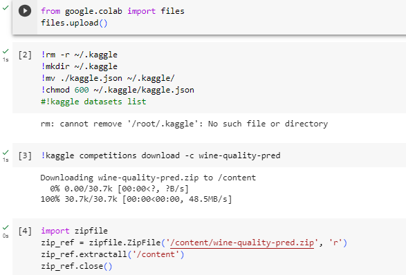
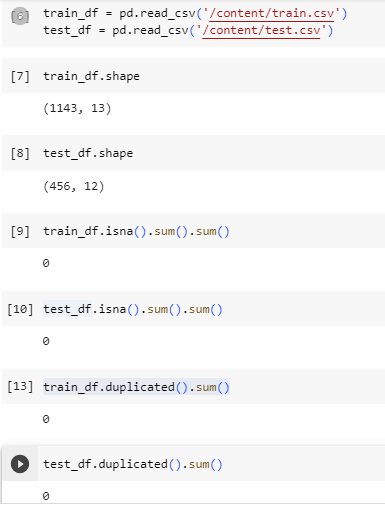
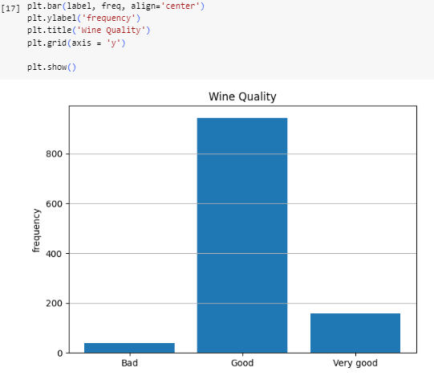
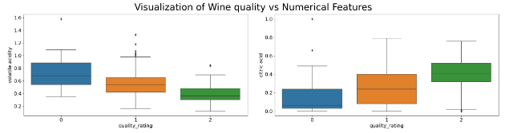
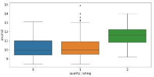
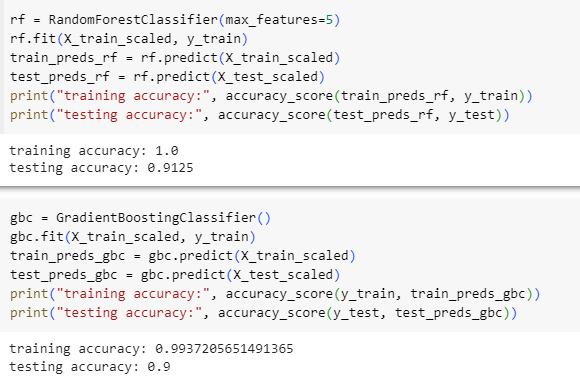
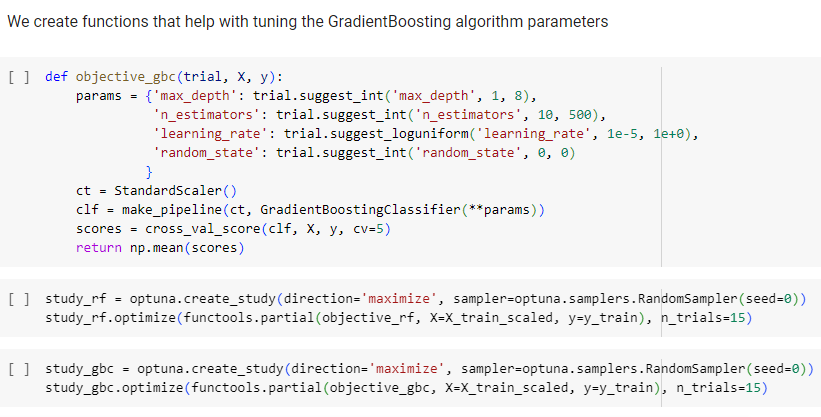
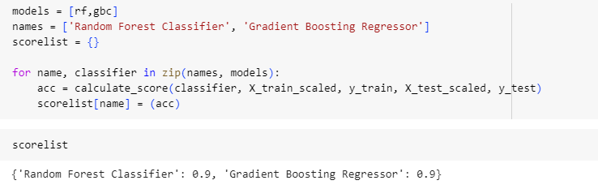
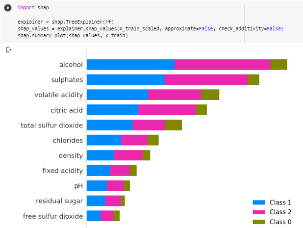

# wine-quality-prediction

## 1. Dataset Overview

### Introduction
These datasets are related to red variants of the Portuguese "Vinho Verde" wine. The dataset describes the amount of various chemicals present in wine and their effect on its quality. The datasets can be viewed as classification or regression tasks. The classes are ordered and not balanced (e.g. there are many more normal wines than excellent or poor ones). Our task is to predict the quality of wine using the given data.

These datasets are from one of the many competitions from [Kaggle](https://www.kaggle.com/competitions/wine-quality-pred/overview) and the scoring metric for this competition is categorization accuracy. We were given two datasets, a training, and a testing dataset, both of which were CSV files. The train dataset comprised similar columns to the test dataset, however, had a quality column that differentiated it from the test dataset.

### Description
Input variables (based on physicochemical tests):
1 - Fixed acidity
2 - Volatile acidity
3 - Citric acid
4 - Residual sugar
5 - Chlorides
6 - Free sulfur dioxide
7 - Total sulfur dioxide
8 - Density
9 - pH
10 - Sulphates
11 - Alcohol

Output variable (based on sensory data):

12 - quality (score between 0 and 10)

### Project Goal/Motivation
One of the goals of this project is to construct a prediction model that infers wine quality based on some chemical facts. We also intend to find the most important features that drive the quality of wine. 

## 2. Data Collection and Exploration
Data was downloaded from the Kaggle competition website using my unique Kaggle API key. See the steps below.

The train dataset was checked for missing info and duplicates.

## Exploration data analysis
We explore our data first by dividing our target variables into three classes.

Furthermore, we plot a heatmap to check for correlation, a distribution plot and a boxplot amongst the independent variables.

Using a boxplot again, we plot the numerical features against the 'Quality Rating' target variable

We observe that Citric acid content increases while Volatile acidity content reduces considerably as the wine gets better.

We also observe that Alcohol content in the very good wine is considerably higher than the other classes of wine.

## Feature engineering and Preprocessing

Outliers are removed and our datasets scaled to reduce potential noise in the data.

## Model building
Since we are working on a multiclass classification problem we decide to go with RandomForest, DecisionTree, KNearestNeighbor, SVM and GradientBoosting Algorithms. 
Our best performing algorithms are RandomForest and GradientBoosting.

### Hyperparameter tuning
We decided to do a bit of hyperparameter tuning to improve our classification accuracy.
With the help of functions and optuna, we hypertuned our best performing algorithms and acheived an accuracy of 90% for both.

### Calculating the importance of features using SHAP
We wanted to see which features were most influential in predicting the quality of the wine.
SHAP helps to explain machine learning models taking into consideration the influence of each feature. We did this for the RandomForest model.

## Conclusion
As seen from the chart above, our most important features are Alcohol, Sulphates and Volatile acidity.

